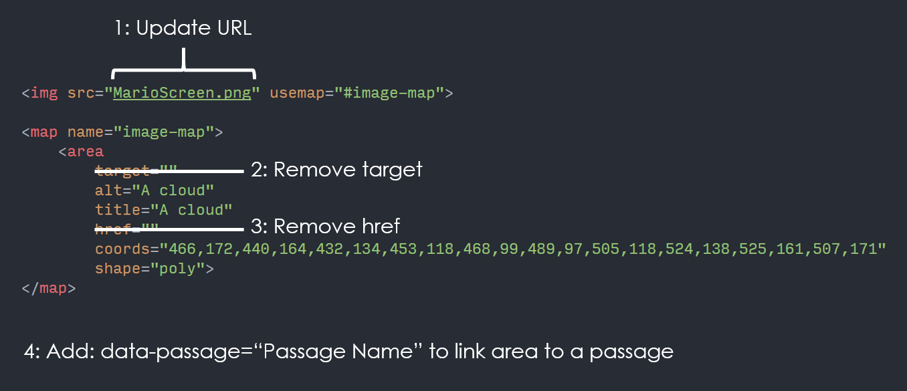

# Clickable Images with HTML Maps

This demo shows how to use the HTML map tag to define clickable regions of an image inside of a twine. It also shows how to use the jquery.maphilight library to give the player visual feedback when they hover over areas of the image.

See the [live demos](//mikewesthad.com/twine-resources/demos/html-maps/examples.html) in examples.html. You can import examples.html into Twine and open it up. The demos are heavily commented.

## HTML Maps and Areas

The HTML map tag allows you to define clickable regions within an image. While not often used in web developement, it is a lovely tool for creating Twines with visual navigation.

For a description and demo of the underlying HTML tag, see this w3schools [reference](http://www.w3schools.com/tags/tag_map.asp).

## Creating the Map

Creating an HTML map by hand is tedious. Instead you'll want to use an online tool for generating HTML maps. I recommend [image-map.net](https://www.image-map.net/).  

1. Upload your desired image.
2. Define your areas. I recommend using polygons. Leave the link and target fields blank. 
3. (Optional) Fill in the title tags. Whatever you put here will show up as a tooltip on desktop browsers.
4. Copy the HTML code.

## Transfering to Twine

The HTML code needs to be tweaked for it to work with SugarCube:

1. Update the image URL 
2. Remove the `target` & `href` attributes from each area
3. Add a `data-passage` attribute to each area. This allows SugarCube to turn the area into a link that points to another passage. E.g. adding `data-passage=clouds` would turn the area into a link that takes the player to the "clouds" passage. (See SugarCube [documentation](http://www.motoslave.net/sugarcube/2/docs/markup.html#html-attributes).)

**Before:**



**After:**


## Highlighting the Map

maphilight is a JavaScript plugin for jQuery that allows you to add hover effects to the regions of your image. You can see the plugin's documentation [here](http://davidlynch.org/projects/maphilight/docs/). It includes some examples that show you what the plugin can do and how to use it. You can find the source code for the library [here](https://github.com/kemayo/maphilight).

We can easily integrate this library into a SugarCube twine:

1. Copy the contents of [jquery.maphilight-modified.min.js](jquery.maphilight-modified.min.js) into your story JavaScript in Twine. This is a slightly modified version of maphilight that works in SugarCube.
2. Add some JavaScript to PassageDone to activate maphilight. PassageDone is a special passage in SugarCube that runs after _every_ passage has finished displaying to the page. We need to use PassageDone here to tell maphilight which elements to highlight.

Below are the examples from the PassageDone code in examples.html. Check out [hslpicker.com](http://hslpicker.com/) for picking HEX colors for styling. First up, setting the default style for all maps:

```
<<script>>

// Apply maphilight to all images that have a usemap attribute, e.g.
// all the maps that are in this twine. This sets the default styling
// for all the maps. These are all the possible styling options.
// Note: for picking colors, check out http://hslpicker.com/. You can
// copy the HEX value as long as you leave off the "#".
$("img[usemap]").maphilight({
  fill: true,             	// Fill the area?
  fillColor: 'dd319b',    	// HEX format without the starting "#"
  fillOpacity: 0.5,       	// Opacity of the filled area
  stroke: true,           	// Outline the area?
  strokeColor: 'ef9ace',
  strokeOpacity: 1,
  strokeWidth: 3,			// Outline width
  fade: true,             	// Animate when hovered with a fade?
  alwaysOn: false,        	// Always show the areas?
  neverOn: false,
  groupBy: false,
  wrapClass: true,
  shadow: false,
  shadowX: 0,
  shadowY: 0,
  shadowRadius: 6,
  shadowColor: '000000',
  shadowOpacity: 0.8,
  shadowPosition: 'outside',
  shadowFrom: false
});

<</script>>
```  

Next, if you have multiple maps, and you want them to have different styling:

```
<<script>>

// If you have multiple maps in your story and you want to apply
// different styling to each:
//	1: Put a class on each map (or maps) that needs different styling
// 	2: Use the below code, but replace "show-all-map" with the 
//     class name
// Note: you can use any of the styling options here. Any that you
// don't specify are set by the default styling.
$("img.show-all-map").data("maphilight", {
  fillColor: '00ffff', 
  stroke: false,
  alwaysOn: true
});

$("img[usemap]").maphilight({
  // Code ommitted for brevity - don't leave out the options here!
});

<</script>>
```  

Finally, if you want to style some of the areas differently:

```
<<script>>

// If you want to have multiple areas with different styling:
//	1: Put a class on the area (or areas) that needs different styling
// 	2: Use the below code, but replace "green-area" with the 
//     class name
// Note: you can use any of the styling options here. Any that you
// don't specify are set by the default styling.
$("area.green-area").data("maphilight", {
  fillColor: '13dd38', 
  fillOpacity: 0.25,
  strokeColor: '9aefaa',
  strokeOpacity: 0.5
});


$("img[usemap]").maphilight({
  // Code ommitted for brevity - don't leave out the options here!
});

<</script>>
```  