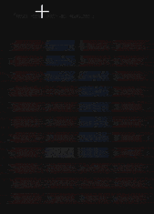

# `<<onmouse>>`

See the [live demos](//mikewesthad.com/twine-resources/macros/mouse/example.html) in example.html to see the macros in action. You can import example.html into Twine and open it up. The demos are heavily commented.



## Installation

- Copy the contents of [mouse.js](//raw.githubusercontent.com/mikewesthad/twine-resources/master/macros/mouse/mouse.js) into story javascript.

## `<<onmouse>>`

`<<onmouse mouseEventName targetSelector (shouldWrap)>>`, `<<andonmouse eventName>>`, `<</onmouse>>`

The contents of the macro won't be executed unless the specified mouse event happens to the selected element. E.g. you can use this macro to create text that changes when the mouse moves over an element in your passage.

Like `<<elseif>>`, this macro can be chained to handle multiple mouse events on the same target using `<<andonmouse eventName>>`. E.g. you can run some code when the mouse enters an element and some other code when the mouse leaves the element.

**Arguments:**

- **mouseEventName**: A string containing one of the possible mouse event names. They must be one of the following.
	- "enter" (when the mouse enters an element that it wasn't hovering over)
	- "leave" (when a mouse leaves an element it was hovering over)
	- "move" (when a mouse moves while over an element)
	- "over" (similar to "enter", see [reference](http://www.w3schools.com/jquery/tryit.asp?filename=tryjquery_event_mouseenter_mouseover))
	- "out" (similar to "leave", see [reference](http://www.w3schools.com/jquery/tryit.asp?filename=tryjquery_event_mouseenter_mouseover))
- **targetSelector**: The CSS/jQuery-style selector used to target element(s).
- **shouldWrap**: a Boolean (true or false) that specifies whether the target should be wrapped in a inline-block div element. This is only necessary when using this macro with text that spans multiple lines. 

**Usage:**

```
➡️ Simple hover change
<a id="hover">Don't touch me</a>

<<silently>>
	<<onmouse "enter" "#hover">>
		<<replace "#hover">>Ouch!<</replace>>
	<</onmouse>>
<</silently>>


➡️ Handling entering and leaving
<a id="stay">Come to me</a>

<<silently>>
	<<onmouse "enter" "#stay">>
  		<<replace "#stay">>Stay with me :)<</replace>>
	<<andonmouse "leave">>
		<<replace "#stay">>You've left me :(<</replace>>
	<</onmouse>>
<</silently>>


➡️ When text is going to span multiple lines, use shouldWrap to allow the events to be triggered when the mouse is hovering between the lines of text.
<a id="friction">Rub me</a>
<<silently>>
 	<<onmouse "move" "#friction" true>>
		<<append "#friction">> more<</append>>
	<<andonmouse "leave">>
		<<replace "#friction">>Rub me again<</replace>>
 	<</onmouse>>
<</silently>>
```